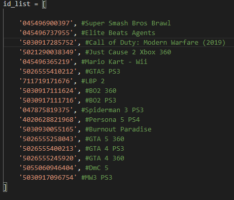
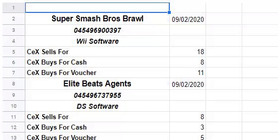

# WeBuy Cex Price Tracker   

A python script that gets the prices of certain WeBuy CeX products and uploads them to google sheets. Based on [CEX-API](https://github.com/teamplz/CEX-API), uses the [Irish version of webuy.com](https://ie.webuy.com/).

## Getting Started

The script is currently able to get the information of multiple products using their id's. Put in the id's of the games you want and you will get their prices.

### Prerequisites

You will need the latest version of [Python](https://www.python.org/downloads/), [OAuth2Client](https://oauth2client.readthedocs.io/en/latest/#supported-python-versions), [Requests](https://pypi.org/project/requests/), 
[GSpread](https://pypi.org/project/gspread/) and [GSpread-Formatting](https://pypi.org/project/gspread-formatting/).

There is a [requirements.txt](requirements.txt) file included that has everything you need in it. Just run this command before running the script and you should be good to go:

```python
pip install -r requirements.txt
```

### Installing

After downloading the files and prerequisites you can enter the id's of the products you want to check into [id_list.py](id_list.py).  Then make sure you put the credentials file into the folder, name it client_secret.json, and put the sheets' name into [main.py](main.py).

```python
sheet = client.open("name of sheet here").sheet1
```

### Running

Running the script as is should return the information for some products. The dupeChecker() function will check for any duplicate id's in your list and then the update_list() function will check for new id's and ungenerated google sheet products.

PriceUpdate() will then lookup each id on the CeX website, get it's prices and print it onto the google sheet.

However, be aware that if you add a lot of id's you will need to deal with Google Sheets' API [Usage Limits](https://developers.google.com/sheets/api/limits). I have added a basic cooldown function in [main.py](main.py) and [addon.py](addon.py) however it isn't perfect, if you're looking into adding A LOT of id's you should try manipulating the wait time.

```python
time.sleep(100)
```

Optionally you can use the nandi() function to scan the google sheet for any names and id's and print them to the console.





## License

This project is licensed under the MIT License - see the [LICENSE.md](LICENSE.md) file for details

## Acknowledgement

Big thanks to [Sothclaws](https://github.com/Southclaws) for his [CeX Go Client](https://github.com/Southclaws/go-cex) and [teamplz](https://github.com/teamplz) for his [CEX-API](https://github.com/teamplz/CEX-API). They really helped me out and saved me a lot of time!
